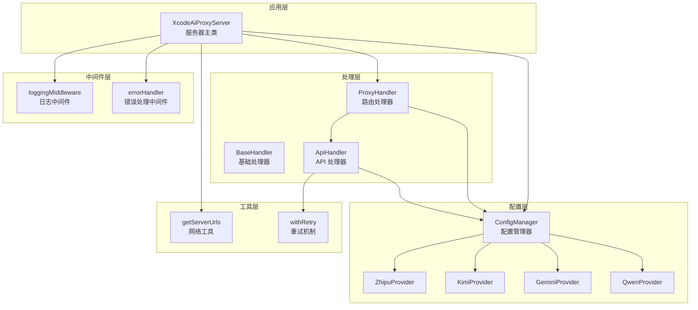
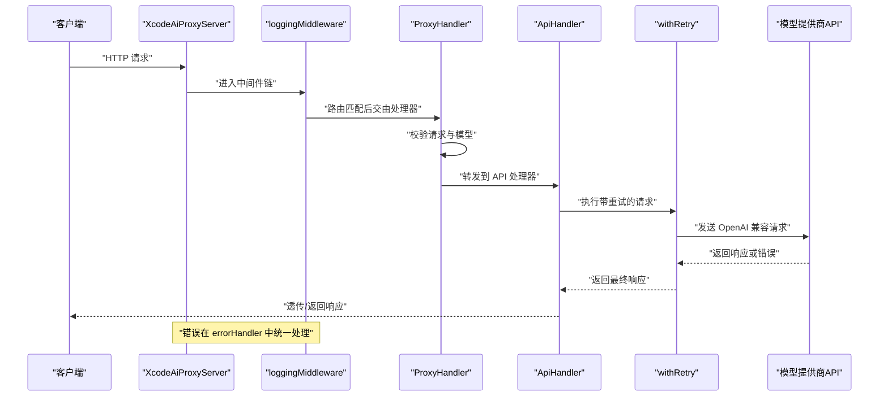
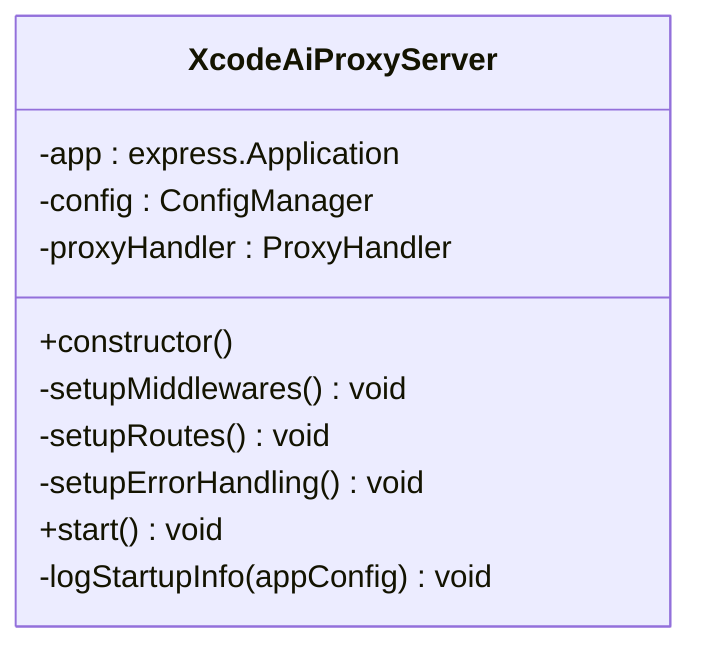
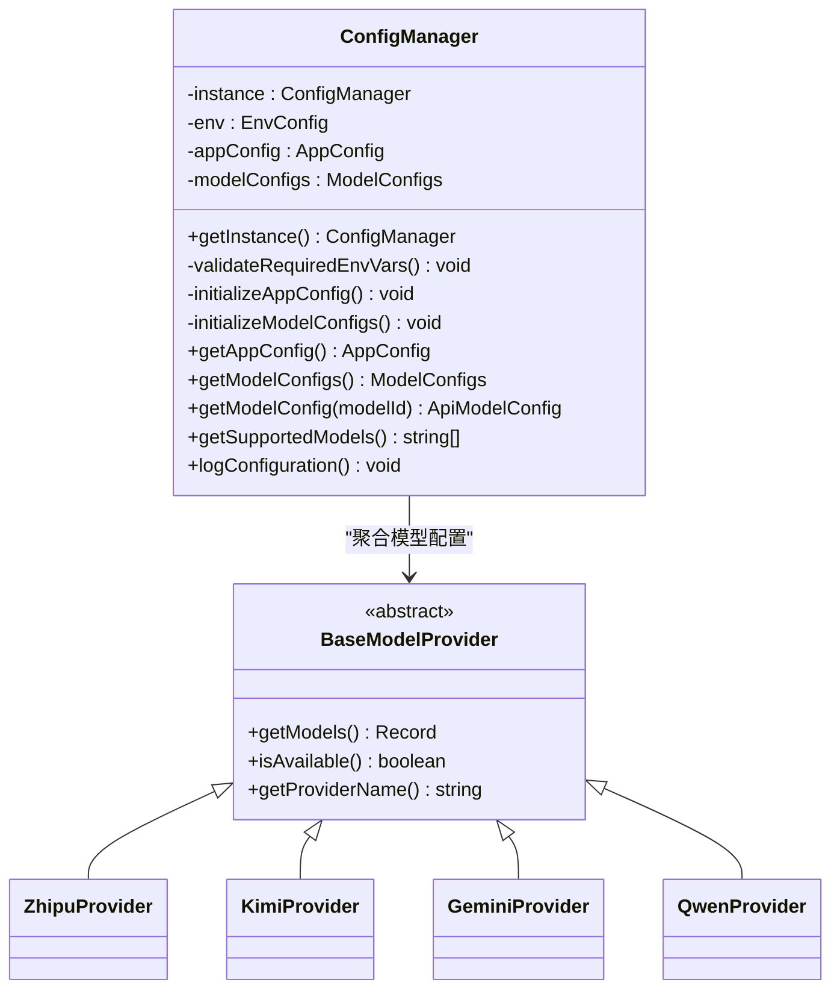
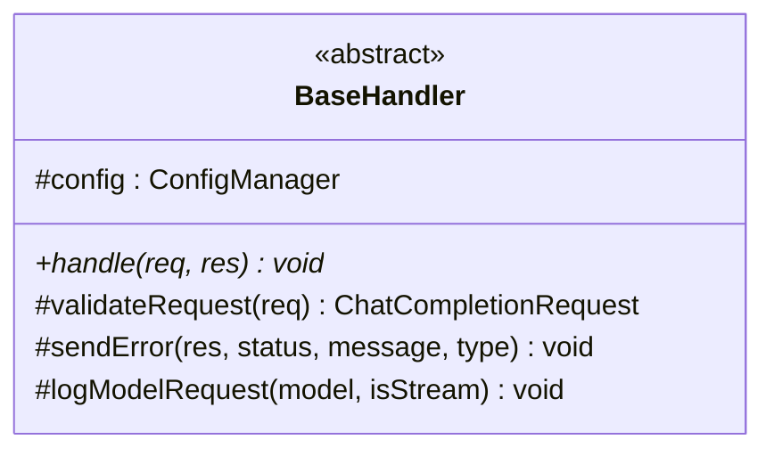
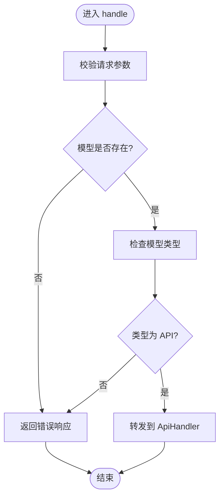
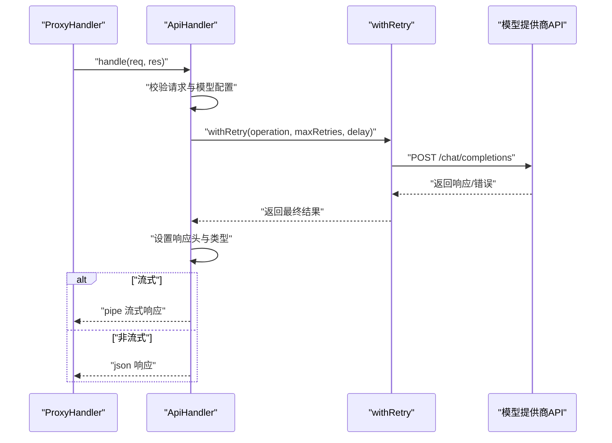
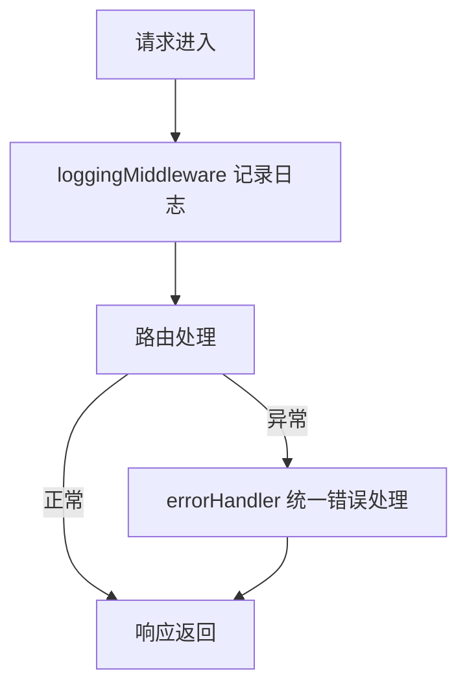
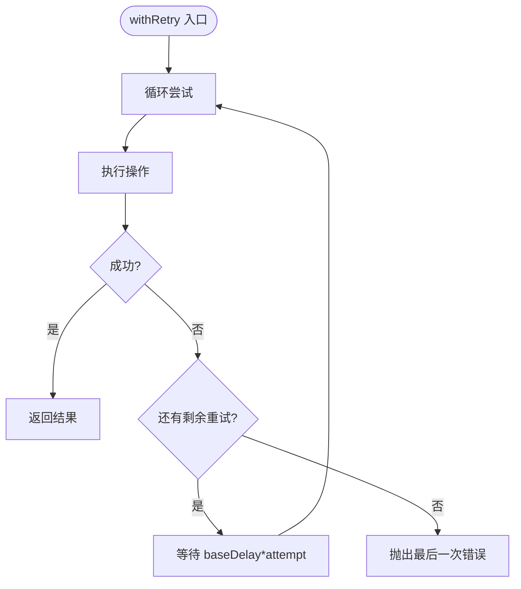
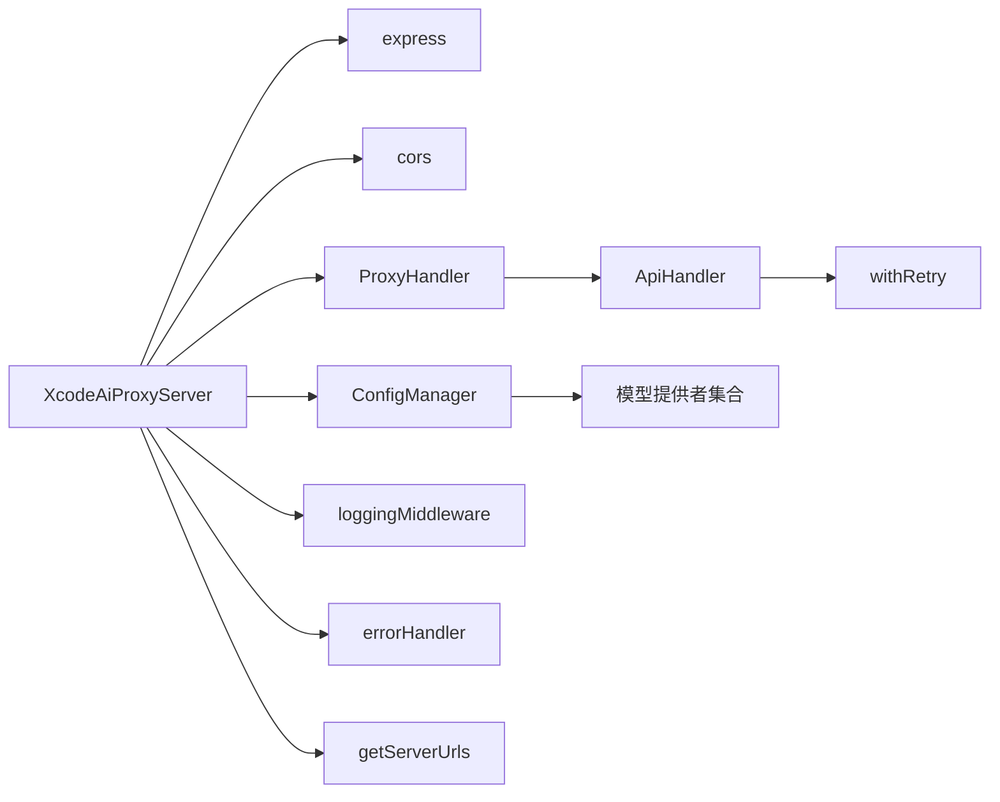

# 架构概览

<cite>
**本文档引用的文件**
- [src/server.ts](file://src/server.ts)
- [src/config/config.ts](file://src/config/config.ts)
- [src/config/models/base.ts](file://src/config/models/base.ts)
- [src/config/models/zhipu.ts](file://src/config/models/zhipu.ts)
- [src/config/models/kimi.ts](file://src/config/models/kimi.ts)
- [src/config/models/gemini.ts](file://src/config/models/gemini.ts)
- [src/config/models/qwen.ts](file://src/config/models/qwen.ts)
- [src/handlers/base.ts](file://src/handlers/base.ts)
- [src/handlers/proxy.ts](file://src/handlers/proxy.ts)
- [src/handlers/api.ts](file://src/handlers/api.ts)
- [src/middlewares/common.ts](file://src/middlewares/common.ts)
- [src/utils/network.ts](file://src/utils/network.ts)
- [src/utils/retry.ts](file://src/utils/retry.ts)
- [package.json](file://package.json)
</cite>

## 目录
1. [简介](#简介)
2. [项目结构](#项目结构)
3. [核心组件](#核心组件)
4. [架构总览](#架构总览)
5. [详细组件分析](#详细组件分析)
6. [依赖关系分析](#依赖关系分析)
7. [性能考虑](#性能考虑)
8. [故障排除指南](#故障排除指南)
9. [结论](#结论)

## 简介
本项目为 Xcode AI 代理服务，提供统一的 OpenAI 兼容 API 接口，支持多模型提供商（智谱、Kimi、Gemini、通义千问）的代理转发与流式响应。系统采用分层架构与中间件模式，具备良好的可扩展性与可维护性，支持动态配置、智能重试、跨平台部署与多网卡访问地址展示。

## 项目结构
项目采用按功能模块划分的目录结构，核心层次如下：
- 顶层入口：Express 应用与服务器启动逻辑
- 配置层：集中式配置管理与模型提供者工厂
- 处理层：基础处理器与具体路由处理器
- 中间件层：通用日志与错误处理中间件
- 工具层：网络工具、重试机制与日志输出
- 类型层：统一的请求/响应与配置类型定义

**图示来源**
- [src/server.ts:1-88](file://src/server.ts#L1-L88)
- [src/config/config.ts:1-123](file://src/config/config.ts#L1-L123)
- [src/handlers/base.ts:1-40](file://src/handlers/base.ts#L1-L40)
- [src/handlers/proxy.ts:1-66](file://src/handlers/proxy.ts#L1-L66)
- [src/handlers/api.ts:1-196](file://src/handlers/api.ts#L1-L196)
- [src/middlewares/common.ts:1-25](file://src/middlewares/common.ts#L1-L25)
- [src/utils/network.ts:1-51](file://src/utils/network.ts#L1-L51)
- [src/utils/retry.ts:1-34](file://src/utils/retry.ts#L1-L34)

**章节来源**
- [src/server.ts:1-88](file://src/server.ts#L1-L88)
- [package.json:1-30](file://package.json#L1-L30)

## 核心组件
- XcodeAiProxyServer：服务器主类，负责 Express 应用初始化、中间件注册、路由绑定与启动日志输出。
- ConfigManager：配置管理器，单例模式，负责环境变量校验、应用配置与模型配置初始化，并提供模型查询能力。
- ProxyHandler：路由处理器，继承基础处理器，负责模型校验、路由分发与健康检查、模型列表接口。
- ApiHandler：API 处理器，继承基础处理器，负责将请求转发到各模型提供商，支持流式与非流式响应、错误透传与重试。
- 中间件系统：loggingMiddleware 提供统一日志；errorHandler 提供统一错误响应。
- 模型提供者：基于 BaseModelProvider 抽象，不同提供商实现各自的模型映射与可用性判断。

**章节来源**
- [src/server.ts:8-84](file://src/server.ts#L8-L84)
- [src/config/config.ts:7-123](file://src/config/config.ts#L7-L123)
- [src/handlers/base.ts:5-40](file://src/handlers/base.ts#L5-L40)
- [src/handlers/proxy.ts:6-66](file://src/handlers/proxy.ts#L6-L66)
- [src/handlers/api.ts:8-196](file://src/handlers/api.ts#L8-L196)
- [src/middlewares/common.ts:4-25](file://src/middlewares/common.ts#L4-L25)
- [src/config/models/base.ts:3-7](file://src/config/models/base.ts#L3-L7)

## 架构总览
系统采用分层架构与中间件模式，核心交互流程如下：
- 服务器启动：XcodeAiProxyServer 初始化 Express、注册中间件与路由，启动监听。
- 请求进入：loggingMiddleware 记录请求信息，随后根据路由交由 ProxyHandler 处理。
- 路由处理：ProxyHandler 校验请求参数与模型可用性，将 API 类模型请求转交给 ApiHandler。
- API 处理：ApiHandler 构造 OpenAI 兼容请求，注入中文交流指令与自定义系统提示，调用 withRetry 执行重试，透传或返回响应。
- 错误处理：errorHandler 捕获未处理异常，返回标准化错误响应。

**图示来源**
- [src/server.ts:23-44](file://src/server.ts#L23-L44)
- [src/handlers/proxy.ts:9-37](file://src/handlers/proxy.ts#L9-L37)
- [src/handlers/api.ts:30-195](file://src/handlers/api.ts#L30-L195)
- [src/middlewares/common.ts:9-25](file://src/middlewares/common.ts#L9-L25)
- [src/utils/retry.ts:1-26](file://src/utils/retry.ts#L1-L26)

## 详细组件分析

### 服务器主类 XcodeAiProxyServer
- 职责：创建 Express 实例，注入单例 ConfigManager 与 ProxyHandler，注册 CORS、JSON 解析、日志中间件与错误处理中间件；绑定健康检查、模型列表与聊天补全路由；启动服务并打印启动信息。
- 关键特性：支持多网卡访问地址自动发现与展示，列出支持模型与重试配置，提供 Xcode 配置指引。

**图示来源**
- [src/server.ts:8-84](file://src/server.ts#L8-L84)

**章节来源**
- [src/server.ts:8-84](file://src/server.ts#L8-L84)

### 配置管理器 ConfigManager
- 设计模式：单例模式，getInstance 提供全局唯一实例。
- 职责：校验至少存在一个 API 密钥；初始化应用配置（端口、主机、重试次数、延迟、超时、自定义系统提示）；聚合各模型提供者的模型配置；提供模型查询与日志输出。
- 可扩展性：新增模型只需新增 Provider 并在初始化中注册，无需修改现有逻辑。

**图示来源**
- [src/config/config.ts:7-123](file://src/config/config.ts#L7-L123)
- [src/config/models/base.ts:3-7](file://src/config/models/base.ts#L3-L7)
- [src/config/models/zhipu.ts:4-34](file://src/config/models/zhipu.ts#L4-L34)
- [src/config/models/kimi.ts:4-34](file://src/config/models/kimi.ts#L4-L34)
- [src/config/models/gemini.ts:4-34](file://src/config/models/gemini.ts#L4-L34)
- [src/config/models/qwen.ts:4-35](file://src/config/models/qwen.ts#L4-L35)

**章节来源**
- [src/config/config.ts:7-123](file://src/config/config.ts#L7-L123)
- [src/config/models/base.ts:3-7](file://src/config/models/base.ts#L3-L7)
- [src/config/models/zhipu.ts:4-34](file://src/config/models/zhipu.ts#L4-L34)
- [src/config/models/kimi.ts:4-34](file://src/config/models/kimi.ts#L4-L34)
- [src/config/models/gemini.ts:4-34](file://src/config/models/gemini.ts#L4-L34)
- [src/config/models/qwen.ts:4-35](file://src/config/models/qwen.ts#L4-L35)

### 基础处理器 BaseHandler
- 职责：统一请求参数校验（model、messages）、错误响应封装、日志输出；作为所有处理器的基类。
- 设计模式：模板方法（抽象类），子类仅需实现 handle 方法。

**图示来源**
- [src/handlers/base.ts:5-40](file://src/handlers/base.ts#L5-L40)

**章节来源**
- [src/handlers/base.ts:5-40](file://src/handlers/base.ts#L5-L40)

### 路由处理器 ProxyHandler
- 职责：处理健康检查、模型列表与聊天补全请求；校验模型是否受支持；将 API 类模型请求转发给 ApiHandler。
- 流程：校验请求 -> 查询模型配置 -> 分发到 ApiHandler（当前版本仅支持 API 类模型）。

**图示来源**
- [src/handlers/proxy.ts:9-37](file://src/handlers/proxy.ts#L9-L37)

**章节来源**
- [src/handlers/proxy.ts:6-66](file://src/handlers/proxy.ts#L6-L66)

### API 处理器 ApiHandler
- 职责：构造 OpenAI 兼容请求，注入中文交流指令与自定义系统提示；根据流式标志设置响应类型；调用 withRetry 执行重试；透传流式响应或返回 JSON 响应；对错误进行解析与透传。
- 特性：支持 KIMI 的 HTTPS Agent、Qwen 的 tools 数组兼容、统一的 4xx 校验与错误透传。

**图示来源**
- [src/handlers/api.ts:9-195](file://src/handlers/api.ts#L9-L195)
- [src/utils/retry.ts:1-26](file://src/utils/retry.ts#L1-L26)

**章节来源**
- [src/handlers/api.ts:8-196](file://src/handlers/api.ts#L8-L196)
- [src/utils/retry.ts:1-34](file://src/utils/retry.ts#L1-L34)

### 中间件系统
- loggingMiddleware：统一记录请求方法与路径，便于调试与审计。
- errorHandler：捕获未处理异常，返回标准化错误响应，避免重复设置响应头。

**图示来源**
- [src/middlewares/common.ts:4-25](file://src/middlewares/common.ts#L4-L25)

**章节来源**
- [src/middlewares/common.ts:4-25](file://src/middlewares/common.ts#L4-L25)

### 工具与网络
- getServerUrls：根据监听主机自动计算可访问的本地与局域网地址，支持多网卡场景。
- withRetry：指数退避重试机制，支持最大重试次数与基础延迟配置。

**图示来源**
- [src/utils/retry.ts:1-26](file://src/utils/retry.ts#L1-L26)
- [src/utils/network.ts:35-51](file://src/utils/network.ts#L35-L51)

**章节来源**
- [src/utils/network.ts:1-51](file://src/utils/network.ts#L1-L51)
- [src/utils/retry.ts:1-34](file://src/utils/retry.ts#L1-L34)

## 依赖关系分析
- 服务器依赖：Express、CORS、ConfigManager、ProxyHandler、loggingMiddleware、errorHandler、网络工具。
- 处理器依赖：BaseHandler、ConfigManager、Axios、withRetry。
- 配置依赖：dotenv、各模型提供者。
- 工具依赖：Node 内置 os 模块、Axios 与 https 模块。

**图示来源**
- [src/server.ts:1-7](file://src/server.ts#L1-L7)
- [src/handlers/proxy.ts:1-4](file://src/handlers/proxy.ts#L1-L4)
- [src/handlers/api.ts:1-6](file://src/handlers/api.ts#L1-L6)
- [src/config/config.ts:1-5](file://src/config/config.ts#L1-L5)
- [src/utils/network.ts:1-1](file://src/utils/network.ts#L1-L1)
- [src/utils/retry.ts:1-1](file://src/utils/retry.ts#L1-L1)

**章节来源**
- [src/server.ts:1-7](file://src/server.ts#L1-L7)
- [package.json:14-29](file://package.json#L14-L29)

## 性能考虑
- 流式响应：当请求为流式时，直接透传上游流以降低内存占用与延迟。
- 重试机制：默认最多 3 次重试，延迟按尝试次数线性增长，避免雪崩效应。
- 超时控制：统一请求超时配置，防止长时间阻塞。
- 日志与调试：禁用压缩便于调试，同时保留必要的日志输出。
- HTTPS 优化：针对特定提供商启用 keepAlive 与超时配置，提升连接复用效率。

## 故障排除指南
- 启动失败：检查至少配置一个 API 密钥，否则进程会退出。
- 模型不可用：确认模型 ID 正确且对应提供商已启用，查看支持的模型列表。
- 流式错误：错误响应可能为流式，系统会尝试读取并解析错误内容，若失败则返回通用错误信息。
- 跨网段访问：监听 0.0.0.0 时会自动列出所有可用访问地址，确保防火墙放行相应端口。
- 自定义系统提示：若配置了自定义提示，将在首个系统消息后注入中文交流指令与自定义内容。

**章节来源**
- [src/config/config.ts:29-51](file://src/config/config.ts#L29-L51)
- [src/handlers/proxy.ts:14-24](file://src/handlers/proxy.ts#L14-L24)
- [src/handlers/api.ts:131-164](file://src/handlers/api.ts#L131-L164)
- [src/utils/network.ts:35-51](file://src/utils/network.ts#L35-L51)

## 结论
本项目通过清晰的分层架构与中间件模式，实现了对多模型提供商的统一代理与扩展。单例配置管理器与工厂化的模型提供者设计，使得新增模型提供商变得简单；统一的处理器基类与重试机制提升了系统的稳定性与可维护性。整体架构在保证易用性的同时，兼顾了性能与可扩展性，适合在 Xcode 等开发环境中作为统一的 AI API 代理服务使用。