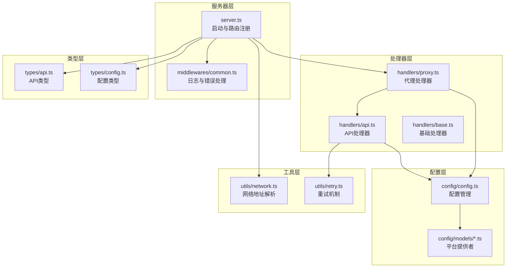
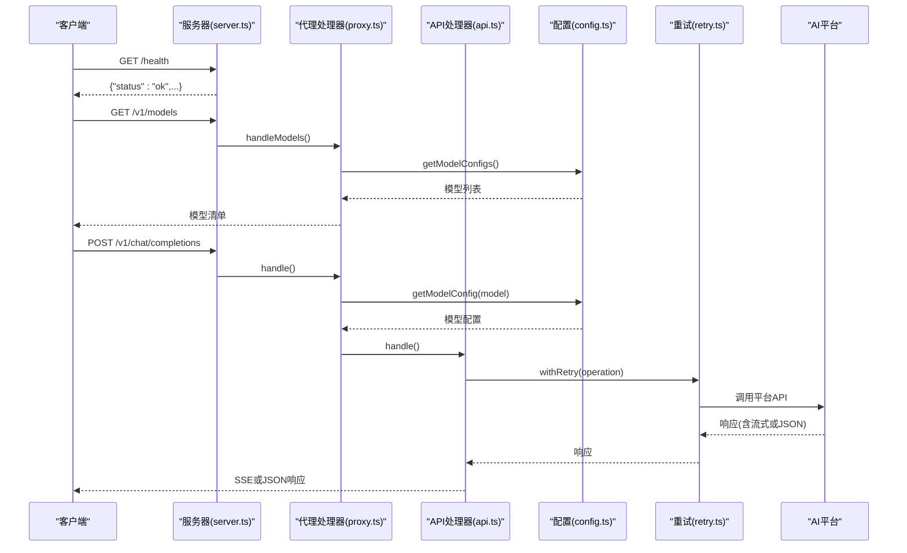
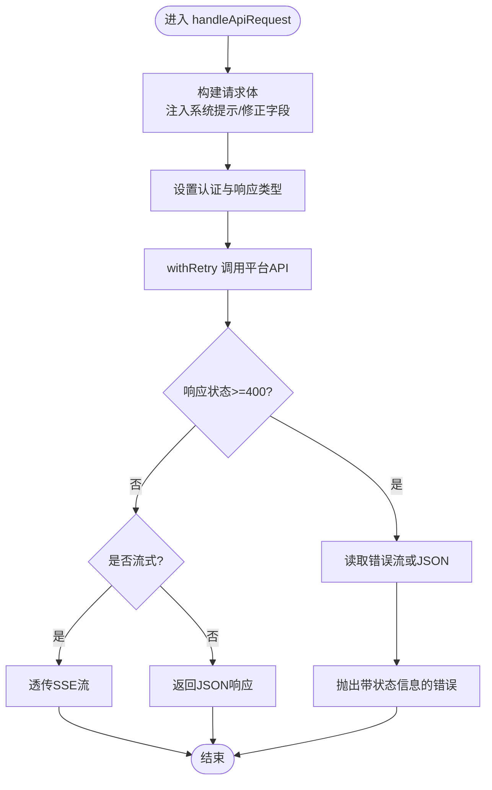
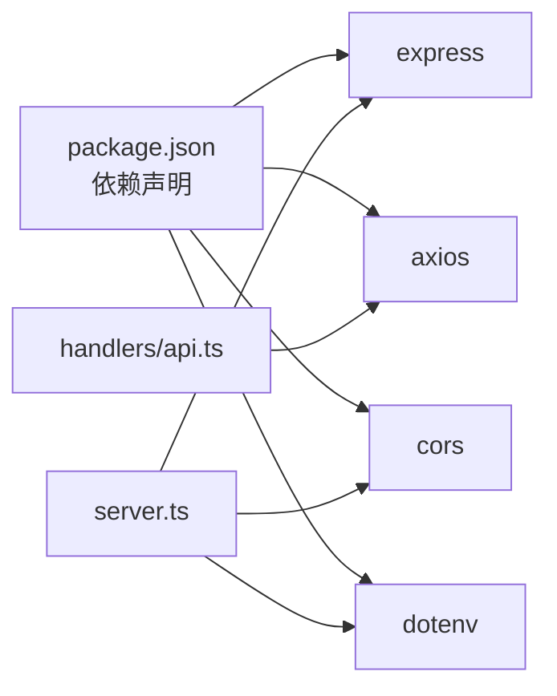

# 核心功能

<cite>
**本文档引用的文件**
- [src/server.ts](file://src/server.ts)
- [src/config/config.ts](file://src/config/config.ts)
- [src/config/models/index.ts](file://src/config/models/index.ts)
- [src/config/models/zhipu.ts](file://src/config/models/zhipu.ts)
- [src/config/models/kimi.ts](file://src/config/models/kimi.ts)
- [src/config/models/gemini.ts](file://src/config/models/gemini.ts)
- [src/config/models/qwen.ts](file://src/config/models/qwen.ts)
- [src/handlers/proxy.ts](file://src/handlers/proxy.ts)
- [src/handlers/api.ts](file://src/handlers/api.ts)
- [src/handlers/base.ts](file://src/handlers/base.ts)
- [src/middlewares/common.ts](file://src/middlewares/common.ts)
- [src/utils/network.ts](file://src/utils/network.ts)
- [src/utils/retry.ts](file://src/utils/retry.ts)
- [src/types/api.ts](file://src/types/api.ts)
- [src/types/config.ts](file://src/types/config.ts)
- [package.json](file://package.json)
</cite>

## 目录
1. [简介](#简介)
2. [项目结构](#项目结构)
3. [核心组件](#核心组件)
4. [架构总览](#架构总览)
5. [详细组件分析](#详细组件分析)
6. [依赖关系分析](#依赖关系分析)
7. [性能考量](#性能考量)
8. [故障排查指南](#故障排查指南)
9. [结论](#结论)
10. [附录](#附录)

## 简介
xcode-ai-proxy 是一个面向 Xcode 的统一 AI 服务代理，旨在为开发者提供一致的 OpenAI 兼容接口，同时支持多个 AI 平台（智谱、Kimi、Google Gemini、通义千问等）。其核心目标是：
- 提供统一的聊天补全接口，隐藏底层平台差异
- 支持流式响应（SSE），满足实时对话体验
- 提供健康检查与模型查询接口，便于集成与监控
- 内置智能重试与错误处理，提升稳定性
- 通过环境变量灵活配置，适配不同部署场景

## 项目结构
项目采用按职责分层的组织方式：
- 服务器入口与路由：在服务器中注册健康检查、模型列表与聊天补全接口，并挂载中间件
- 配置管理：集中加载环境变量、初始化应用配置与各平台模型映射
- 处理器：代理处理器负责路由到具体 API 处理器；API 处理器负责与各平台交互
- 类型定义：统一请求/响应与配置的数据结构
- 工具模块：网络地址解析、重试机制、日志输出
- 中间件：通用日志与全局错误处理

图表来源
- [src/server.ts:29-40](file://src/server.ts#L29-L40)
- [src/config/config.ts:67-97](file://src/config/config.ts#L67-L97)
- [src/handlers/proxy.ts:6-37](file://src/handlers/proxy.ts#L6-L37)
- [src/handlers/api.ts:8-28](file://src/handlers/api.ts#L8-L28)
- [src/utils/network.ts:35-51](file://src/utils/network.ts#L35-L51)
- [src/utils/retry.ts:1-34](file://src/utils/retry.ts#L1-L34)
- [src/types/api.ts:11-58](file://src/types/api.ts#L11-L58)
- [src/types/config.ts:24-48](file://src/types/config.ts#L24-L48)

章节来源
- [src/server.ts:8-88](file://src/server.ts#L8-L88)
- [src/config/config.ts:7-121](file://src/config/config.ts#L7-L121)
- [src/handlers/proxy.ts:6-66](file://src/handlers/proxy.ts#L6-L66)
- [src/handlers/api.ts:8-196](file://src/handlers/api.ts#L8-L196)
- [src/middlewares/common.ts:1-25](file://src/middlewares/common.ts#L1-L25)
- [src/utils/network.ts:1-51](file://src/utils/network.ts#L1-L51)
- [src/utils/retry.ts:1-34](file://src/utils/retry.ts#L1-L34)
- [src/types/api.ts:1-58](file://src/types/api.ts#L1-L58)
- [src/types/config.ts:1-48](file://src/types/config.ts#L1-L48)

## 核心组件
- 服务器与路由：注册健康检查、模型列表与聊天补全接口，设置 CORS、JSON 解析与日志中间件
- 配置管理：校验并加载环境变量，初始化应用配置与模型映射，支持多平台模型聚合
- 代理处理器：校验请求、选择模型、路由到 API 处理器
- API 处理器：构建 OpenAI 兼容请求、注入系统提示、处理流式与非流式响应、执行重试与错误透传
- 中间件：统一日志与错误处理
- 工具：网络地址解析、重试策略、请求日志

章节来源
- [src/server.ts:23-44](file://src/server.ts#L23-L44)
- [src/config/config.ts:27-97](file://src/config/config.ts#L27-L97)
- [src/handlers/proxy.ts:9-37](file://src/handlers/proxy.ts#L9-L37)
- [src/handlers/api.ts:9-28](file://src/handlers/api.ts#L9-L28)
- [src/middlewares/common.ts:4-25](file://src/middlewares/common.ts#L4-L25)
- [src/utils/retry.ts:1-34](file://src/utils/retry.ts#L1-L34)

## 架构总览
下图展示了从客户端请求到平台响应的整体流程，包括健康检查、模型查询与聊天补全的典型调用链。

图表来源
- [src/server.ts:29-40](file://src/server.ts#L29-L40)
- [src/handlers/proxy.ts:39-65](file://src/handlers/proxy.ts#L39-L65)
- [src/handlers/api.ts:30-195](file://src/handlers/api.ts#L30-L195)
- [src/config/config.ts:107-113](file://src/config/config.ts#L107-L113)
- [src/utils/retry.ts:1-34](file://src/utils/retry.ts#L1-L34)

## 详细组件分析

### 服务器与路由
- 路由注册：健康检查、模型列表、多路径聊天补全接口
- 中间件：CORS、JSON 解析（限制 50MB）、日志中间件
- 启动日志：打印可访问地址、支持模型、重试与超时配置，以及 Xcode 配置提示

章节来源
- [src/server.ts:23-44](file://src/server.ts#L23-L44)
- [src/server.ts:46-83](file://src/server.ts#L46-L83)

### 配置管理
- 环境变量校验：至少需配置一个平台 API 密钥
- 应用配置：端口、主机、最大重试次数、重试延迟、请求超时、自定义系统提示
- 模型配置：聚合各平台模型，统一暴露给代理层

章节来源
- [src/config/config.ts:27-49](file://src/config/config.ts#L27-L49)
- [src/config/config.ts:51-65](file://src/config/config.ts#L51-L65)
- [src/config/config.ts:67-97](file://src/config/config.ts#L67-L97)

### 代理处理器
- 请求校验：确保包含 model 与合法 messages
- 模型选择：根据 model 查找配置，不支持则返回错误
- 分发逻辑：当前仅支持 type 为 api 的模型，统一交由 API 处理器处理

章节来源
- [src/handlers/proxy.ts:9-37](file://src/handlers/proxy.ts#L9-L37)
- [src/handlers/proxy.ts:39-57](file://src/handlers/proxy.ts#L39-L57)
- [src/handlers/proxy.ts:59-65](file://src/handlers/proxy.ts#L59-L65)

### API 处理器
- 请求构建：统一使用 OpenAI 兼容格式，注入中文交流指令与自定义系统提示
- 认证与代理：统一 Bearer 认证；Kimi 使用 HTTPS Agent
- 流式与非流式：根据 stream 参数决定响应类型；流式直接透传平台 SSE
- 错误处理：允许 4xx 通过，读取流式错误内容并构造错误对象
- 重试机制：基于 withRetry 实现指数退避重试

图表来源
- [src/handlers/api.ts:30-195](file://src/handlers/api.ts#L30-L195)
- [src/utils/retry.ts:1-34](file://src/utils/retry.ts#L1-L34)

章节来源
- [src/handlers/api.ts:9-28](file://src/handlers/api.ts#L9-L28)
- [src/handlers/api.ts:30-195](file://src/handlers/api.ts#L30-L195)

### 健康检查接口
- 接口：GET /health
- 返回：状态、时间戳、支持模型数量
- 用途：服务存活探测、集成验证

章节来源
- [src/server.ts:30-31](file://src/server.ts#L30-L31)
- [src/handlers/proxy.ts:59-65](file://src/handlers/proxy.ts#L59-L65)

### 模型查询功能
- 接口：GET /v1/models
- 返回：OpenAI 兼容的模型列表，包含 id、owned_by 等字段
- 用途：客户端初始化模型列表、Xcode 插件自动发现

章节来源
- [src/server.ts:33-34](file://src/server.ts#L33-L34)
- [src/handlers/proxy.ts:39-57](file://src/handlers/proxy.ts#L39-L57)

### 聊天补全接口
- 接口：POST /v1/chat/completions、/api/v1/chat/completions、/v1/messages
- 请求：OpenAI 兼容格式，支持 stream、temperature、top_p 等参数
- 响应：非流式返回完整 JSON；流式透传平台 SSE
- 用途：Xcode 插件与第三方客户端统一接入

章节来源
- [src/server.ts:36-39](file://src/server.ts#L36-L39)
- [src/handlers/base.ts:10-22](file://src/handlers/base.ts#L10-L22)
- [src/handlers/api.ts:176-194](file://src/handlers/api.ts#L176-L194)

### 流式响应（SSE）支持
- 实现：当请求携带 stream=true 时，设置 Content-Type 为 text/event-stream，并将平台响应流直连转发
- 适用：Kimi、智谱、通义千问等平台的 OpenAI 兼容端点
- 优势：低延迟、实时反馈，适合 Xcode 实时对话场景

章节来源
- [src/handlers/api.ts:176-183](file://src/handlers/api.ts#L176-L183)
- [src/handlers/api.ts:41-41](file://src/handlers/api.ts#L41-L41)

### 智能重试与错误处理
- 重试：withRetry 实现最多 N 次、递增延迟的重试
- 错误：统一错误响应结构，支持流式错误读取与状态码透传
- 日志：请求方法与路径、模型与流式标记、平台错误详情

章节来源
- [src/utils/retry.ts:1-34](file://src/utils/retry.ts#L1-L34)
- [src/handlers/api.ts:124-164](file://src/handlers/api.ts#L124-L164)
- [src/middlewares/common.ts:9-25](file://src/middlewares/common.ts#L9-L25)

### 支持的 AI 平台与模型
- 平台提供者：智谱、Kimi、Google Gemini、通义千问
- 配置聚合：在配置管理中实例化各提供者并合并模型映射
- 使用场景：统一 OpenAI 兼容接口，屏蔽平台差异

章节来源
- [src/config/config.ts:70-96](file://src/config/config.ts#L70-L96)
- [src/config/models/index.ts:1-5](file://src/config/models/index.ts#L1-L5)

## 依赖关系分析
- 运行时依赖：Express、Axios、CORS、Dotenv
- 开发依赖：TypeScript、ts-node、Nodemon、类型声明
- 关键耦合点：服务器依赖配置管理与处理器；处理器依赖配置与重试工具；API 处理器依赖平台端点

图表来源
- [package.json:14-29](file://package.json#L14-L29)
- [src/server.ts:1-7](file://src/server.ts#L1-L7)
- [src/handlers/api.ts:1-7](file://src/handlers/api.ts#L1-L7)

章节来源
- [package.json:14-29](file://package.json#L14-L29)
- [src/server.ts:1-7](file://src/server.ts#L1-L7)
- [src/handlers/api.ts:1-7](file://src/handlers/api.ts#L1-L7)

## 性能考量
- 流式传输：启用 stream 可显著降低首字节延迟，适合实时对话
- 重试策略：指数退避减少对上游的压力峰值
- 请求超时：可配置的超时时间平衡稳定性与资源占用
- 日志开销：生产环境建议控制日志级别，避免过多 IO 影响吞吐

## 故障排查指南
- 健康检查失败：确认服务已启动、端口未被占用、主机绑定正确
- 模型不可用：检查环境变量是否配置、模型 ID 是否在支持列表中
- 流式无输出：确认请求携带 stream=true、平台端点支持 SSE
- 4xx 错误：查看平台返回的错误内容，确认认证与请求体格式
- 重试失败：检查网络连通性、平台限流与超时设置

章节来源
- [src/server.ts:46-83](file://src/server.ts#L46-L83)
- [src/handlers/proxy.ts:14-24](file://src/handlers/proxy.ts#L14-L24)
- [src/handlers/api.ts:124-164](file://src/handlers/api.ts#L124-L164)
- [src/middlewares/common.ts:9-25](file://src/middlewares/common.ts#L9-L25)

## 结论
xcode-ai-proxy 通过统一的 OpenAI 兼容接口与多平台抽象，实现了“一次接入、多平台运行”的目标。其优势在于：
- 统一接口与数据格式，简化 Xcode 插件与第三方客户端开发
- 完整的流式支持与智能重试，兼顾实时性与稳定性
- 灵活的配置体系与清晰的日志输出，便于运维与问题定位
- 对中文交流的内置提示与自定义系统提示，提升用户体验

## 附录
- 使用场景示例（以路径代替具体代码）：
  - 健康检查：GET [src/server.ts:30-31](file://src/server.ts#L30-L31)
  - 查询模型：GET [src/server.ts:33-34](file://src/server.ts#L33-L34)
  - 聊天补全（非流式）：POST [src/server.ts:36-39](file://src/server.ts#L36-L39)
  - 聊天补全（流式）：POST [src/server.ts:36-39](file://src/server.ts#L36-L39) 并设置 stream=true
- 配置项参考（环境变量）：
  - 平台密钥：ZHIPU_API_KEY、KIMI_API_KEY、GEMINI_API_KEY、QWEN_API_KEY
  - 自定义提示：CUSTOM_SYSTEM_PROMPT
  - 服务参数：PORT、HOST、MAX_RETRIES、RETRY_DELAY、REQUEST_TIMEOUT
- 平台提供者：
  - 智谱：[src/config/models/zhipu.ts](file://src/config/models/zhipu.ts)
  - Kimi：[src/config/models/kimi.ts](file://src/config/models/kimi.ts)
  - Google Gemini：[src/config/models/gemini.ts](file://src/config/models/gemini.ts)
  - 通义千问：[src/config/models/qwen.ts](file://src/config/models/qwen.ts)