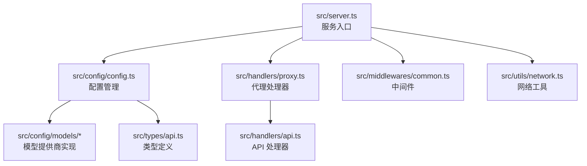
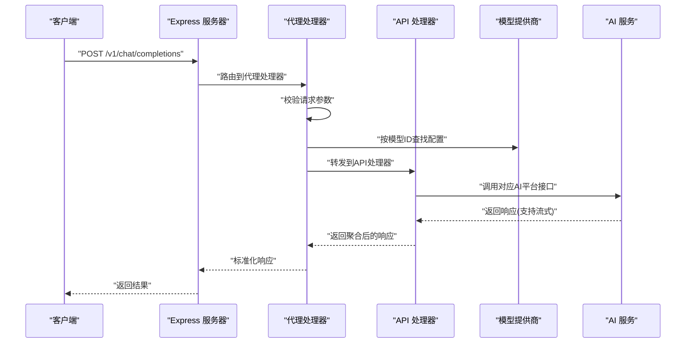
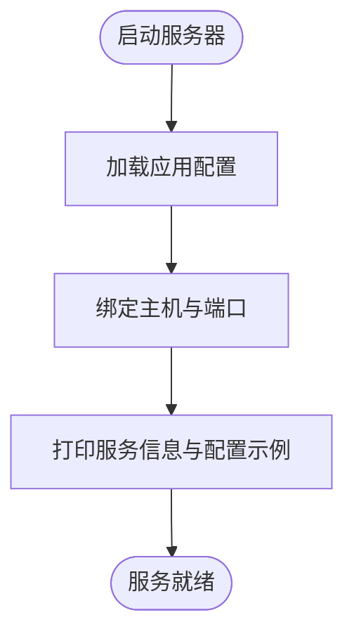
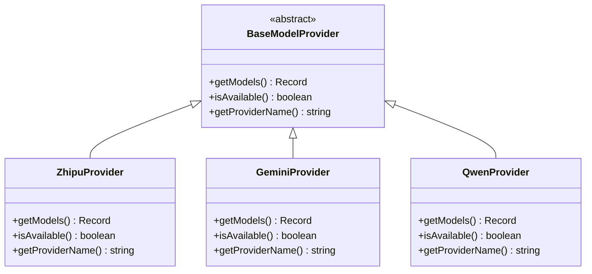
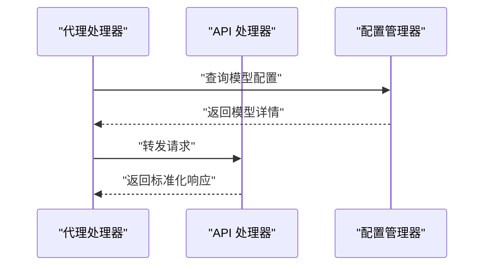
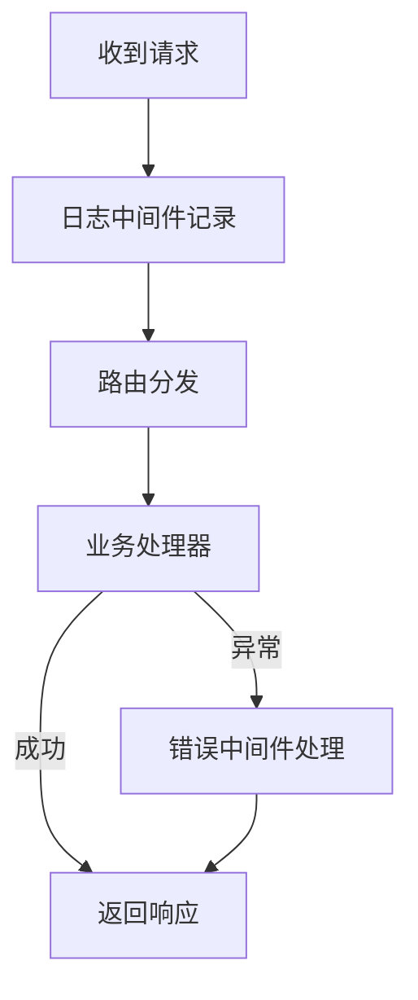
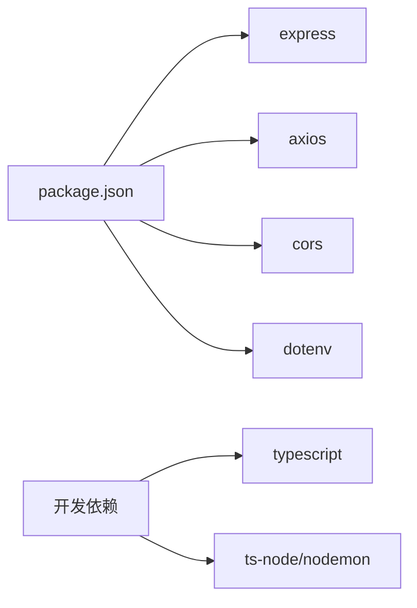

# 项目介绍

<cite>
**本文档引用的文件**
- [package.json](file://package.json)
- [server.ts](file://src/server.ts)
- [config.ts](file://src/config/config.ts)
- [proxy.ts](file://src/handlers/proxy.ts)
- [common.ts](file://src/middlewares/common.ts)
- [network.ts](file://src/utils/network.ts)
- [api.ts](file://src/types/api.ts)
- [index.ts](file://src/config/models/index.ts)
- [base.ts](file://src/config/models/base.ts)
- [qwen.ts](file://src/config/models/qwen.ts)
- [gemini.ts](file://src/config/models/gemini.ts)
- [zhipu.ts](file://src/config/models/zhipu.ts)
</cite>

## 目录
1. [引言](#引言)
2. [项目结构](#项目结构)
3. [核心组件](#核心组件)
4. [架构总览](#架构总览)
5. [详细组件分析](#详细组件分析)
6. [依赖关系分析](#依赖关系分析)
7. [性能考虑](#性能考虑)
8. [故障排除指南](#故障排除指南)
9. [结论](#结论)

## 引言
xcode-ai-proxy 是一个专为 Xcode 开发者设计的统一 AI API 代理服务。它的核心价值在于：
- 简化多 AI 服务提供商的集成：通过单一入口统一管理多个 AI 平台（如智谱、Kimi、Gemini、通义千问），开发者无需关心各平台的差异
- 提供流式响应支持：满足实时对话和代码生成等场景对流式输出的需求
- 为 Xcode 开发环境优化的 API 接口：提供与 OpenAI 兼容的接口风格，便于直接替换 Xcode 中的 AI 服务配置

该服务在开发者工具生态中的定位是“Xcode 的 AI 服务网关”，帮助开发者以最小成本接入多家 AI 能力，并获得一致的开发体验。

## 项目结构
项目采用模块化分层架构，主要目录与职责如下：
- src/config：配置管理与模型提供商抽象，负责读取环境变量、初始化应用配置和模型配置
- src/handlers：请求处理器，包含基础处理器、API 处理器和代理处理器
- src/middlewares：中间件，提供通用的日志记录和错误处理
- src/types：TypeScript 类型定义，涵盖聊天消息、请求/响应结构和配置类型
- src/utils：工具函数，提供网络地址解析、重试机制等辅助能力
- src/server.ts：服务入口，负责初始化 Express 应用、注册路由与中间件、启动服务

图表来源
- [server.ts:1-88](file://src/server.ts#L1-L88)
- [config.ts:1-121](file://src/config/config.ts#L1-L121)
- [proxy.ts:1-66](file://src/handlers/proxy.ts#L1-L66)
- [common.ts:1-25](file://src/middlewares/common.ts#L1-L25)
- [network.ts:1-51](file://src/utils/network.ts#L1-L51)
- [api.ts:1-58](file://src/types/api.ts#L1-L58)

章节来源
- [server.ts:1-88](file://src/server.ts#L1-L88)
- [package.json:1-30](file://package.json#L1-L30)

## 核心组件
- 服务器与路由
  - 初始化 Express 应用，启用 CORS 和 JSON 解析，注册健康检查、模型列表查询和聊天补全接口
  - 支持多路径兼容的聊天补全端点，便于适配不同客户端
- 配置管理
  - 读取环境变量，校验至少配置一个 AI 平台密钥
  - 统一管理应用配置（端口、主机、重试策略、超时）和模型配置（名称、提供商、API 地址、密钥）
- 代理处理器
  - 校验请求参数，根据模型 ID 查找对应配置
  - 将请求转发给对应的 API 处理器进行实际调用
- 中间件
  - 日志中间件：记录每个请求的方法与路径
  - 错误处理中间件：捕获异常并返回标准化错误响应
- 网络工具
  - 自动识别本机 IP 地址，生成可访问的服务 URL 列表，便于在不同网卡或容器环境中使用

章节来源
- [server.ts:23-52](file://src/server.ts#L23-L52)
- [config.ts:27-65](file://src/config/config.ts#L27-L65)
- [proxy.ts:9-37](file://src/handlers/proxy.ts#L9-L37)
- [common.ts:4-25](file://src/middlewares/common.ts#L4-L25)
- [network.ts:35-51](file://src/utils/network.ts#L35-L51)

## 架构总览
下图展示了从客户端到后端服务的整体交互流程，以及配置与模型提供商之间的关系：

图表来源
- [server.ts:29-40](file://src/server.ts#L29-L40)
- [proxy.ts:9-37](file://src/handlers/proxy.ts#L9-L37)
- [config.ts:67-97](file://src/config/config.ts#L67-L97)

## 详细组件分析

### 服务器与路由
- 路由设计
  - 健康检查：用于服务状态探测
  - 模型列表：返回当前支持的所有模型信息
  - 聊天补全：支持多路径，确保与不同客户端兼容
- 启动流程
  - 读取应用配置，监听指定主机与端口
  - 输出服务访问地址、支持的模型、重试与超时配置，以及 Xcode 配置示例

图表来源
- [server.ts:46-83](file://src/server.ts#L46-L83)

章节来源
- [server.ts:29-52](file://src/server.ts#L29-L52)
- [server.ts:54-83](file://src/server.ts#L54-L83)

### 配置管理与模型提供商
- 配置管理器
  - 单例模式，负责验证环境变量、初始化应用配置与模型配置
  - 支持自定义系统提示、最大重试次数、重试延迟、请求超时等
- 模型提供商抽象
  - 抽象类定义统一接口：获取模型列表、判断可用性、提供提供商名称
  - 具体实现包括智谱、Kimi、Gemini、通义千问，每家提供若干模型
- 类关系图

图表来源
- [base.ts:3-7](file://src/config/models/base.ts#L3-L7)
- [zhipu.ts:4-34](file://src/config/models/zhipu.ts#L4-L34)
- [gemini.ts:4-34](file://src/config/models/gemini.ts#L4-L34)
- [qwen.ts:4-35](file://src/config/models/qwen.ts#L4-L35)

章节来源
- [config.ts:67-121](file://src/config/config.ts#L67-L121)
- [base.ts:1-13](file://src/config/models/base.ts#L1-L13)
- [index.ts:1-5](file://src/config/models/index.ts#L1-L5)

### 代理处理器与 API 处理器
- 代理处理器
  - 校验请求体，解析模型 ID
  - 根据模型配置决定是否支持该模型
  - 将请求委托给 API 处理器执行实际调用
  - 提供模型列表与健康检查接口
- API 处理器
  - 负责与具体 AI 平台交互，支持流式响应
  - 统一响应格式，包含消息、完成原因与用量统计

图表来源
- [proxy.ts:9-37](file://src/handlers/proxy.ts#L9-L37)
- [config.ts:107-113](file://src/config/config.ts#L107-L113)

章节来源
- [proxy.ts:1-66](file://src/handlers/proxy.ts#L1-L66)

### 中间件与网络工具
- 日志中间件
  - 记录每次请求的方法与路径，便于调试与审计
- 错误处理中间件
  - 捕获未处理异常，返回统一的错误结构
- 网络工具
  - 自动发现本机 IP 地址，生成可访问的 URL 列表
  - 在监听所有接口时，优先展示常用私有网段地址

图表来源
- [common.ts:4-25](file://src/middlewares/common.ts#L4-L25)
- [network.ts:3-51](file://src/utils/network.ts#L3-L51)

章节来源
- [common.ts:1-25](file://src/middlewares/common.ts#L1-L25)
- [network.ts:1-51](file://src/utils/network.ts#L1-L51)

### 数据模型与类型定义
- 聊天消息与请求
  - 支持用户、助手、系统角色
  - 支持文本内容与流式输出标志
- 响应模型
  - 标准化响应结构，包含消息、完成原因与用量统计
- 错误响应
  - 统一错误类型与消息格式

章节来源
- [api.ts:1-58](file://src/types/api.ts#L1-L58)

## 依赖关系分析
- 运行时依赖
  - express：Web 服务器框架
  - axios：HTTP 客户端，用于调用第三方 AI 平台
  - cors：跨域资源共享支持
  - dotenv：环境变量加载
- 开发依赖
  - TypeScript、ts-node、nodemon 等，用于开发与热重载

图表来源
- [package.json:14-28](file://package.json#L14-L28)

章节来源
- [package.json:1-30](file://package.json#L1-30)

## 性能考虑
- 流式响应
  - 通过代理层透传流式数据，降低内存占用并提升实时性
- 重试与超时
  - 可配置的最大重试次数与递增延迟，提升网络波动下的稳定性
  - 请求超时控制避免长时间阻塞
- 内存与带宽
  - JSON 解析限制与流式传输结合，减少大体积请求的内存压力

## 故障排除指南
- 启动失败：至少配置一个 AI 平台的 API 密钥
  - 现象：启动时输出缺少 API 密钥并退出
  - 处理：设置 ZHIPU_API_KEY、KIMI_API_KEY、GEMINI_API_KEY 或 QWEN_API_KEY 中至少一个
- 模型不可用：请求返回不支持的模型
  - 现象：代理处理器提示不支持的模型
  - 处理：确认模型 ID 是否存在于支持列表，或检查对应提供商的密钥与可用性
- 网络访问问题：无法从 Xcode 访问服务
  - 现象：Xcode 无法连接到本地服务
  - 处理：查看启动日志中列出的访问地址，确认防火墙与网络配置

章节来源
- [config.ts:27-49](file://src/config/config.ts#L27-L49)
- [proxy.ts:14-24](file://src/handlers/proxy.ts#L14-L24)
- [server.ts:54-83](file://src/server.ts#L54-L83)

## 结论
xcode-ai-proxy 通过统一的代理层，将多家 AI 平台的能力整合到 Xcode 开发环境中，显著降低了多平台集成的复杂度。其简洁的接口设计、完善的错误处理与可观测性，使得开发者可以专注于业务逻辑，而无需关心底层服务细节。对于希望在 Xcode 中无缝使用多种 AI 能力的团队而言，这是一个高性价比的基础设施选择。