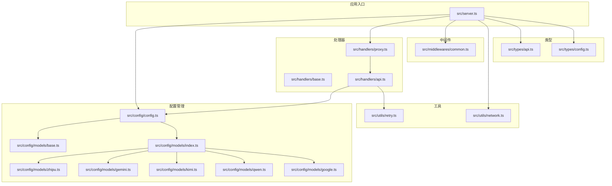
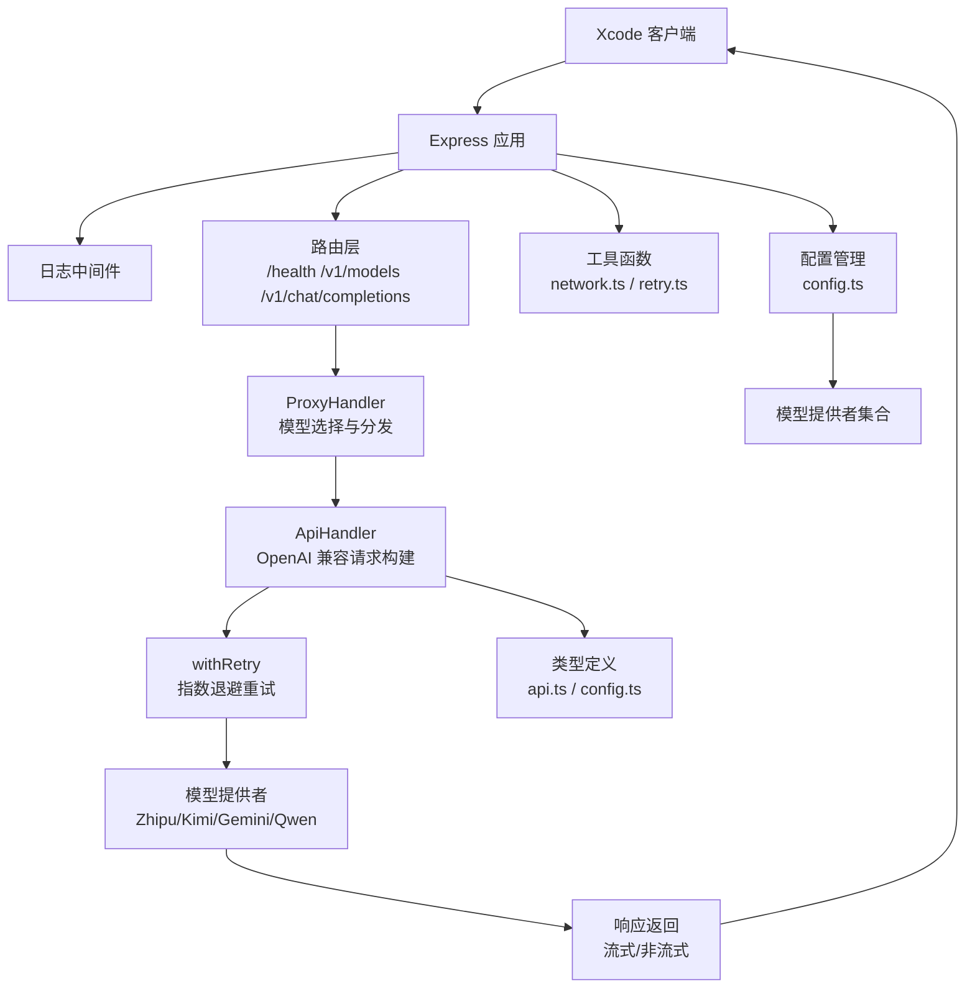
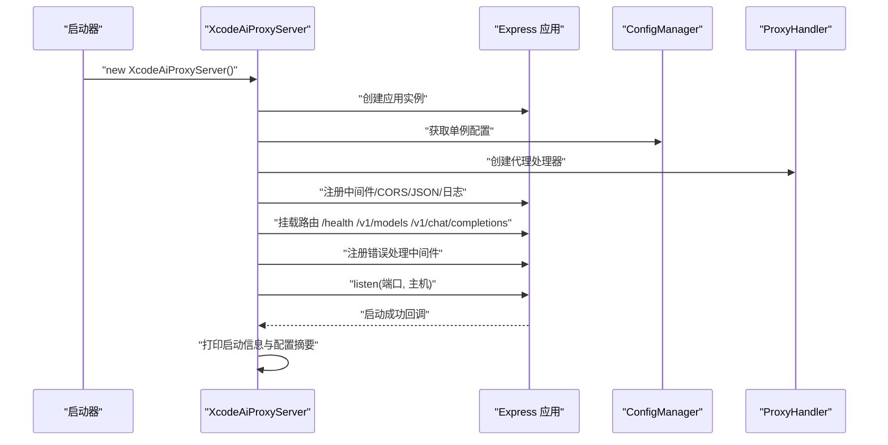
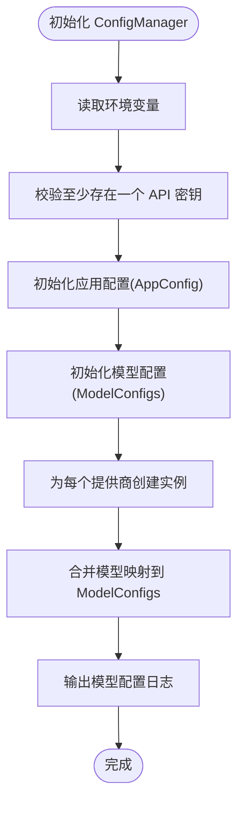
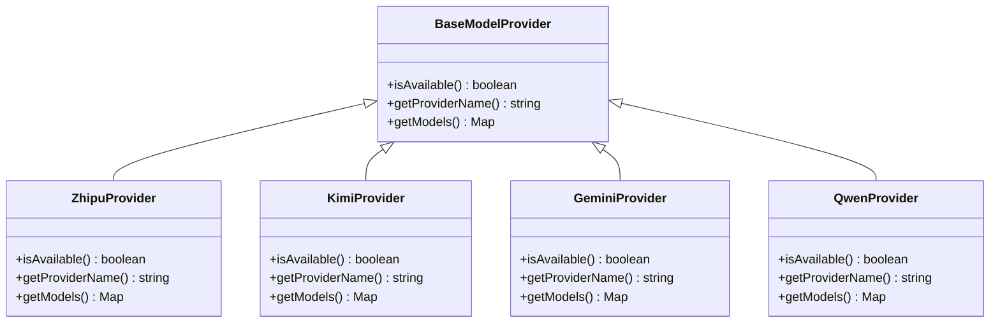
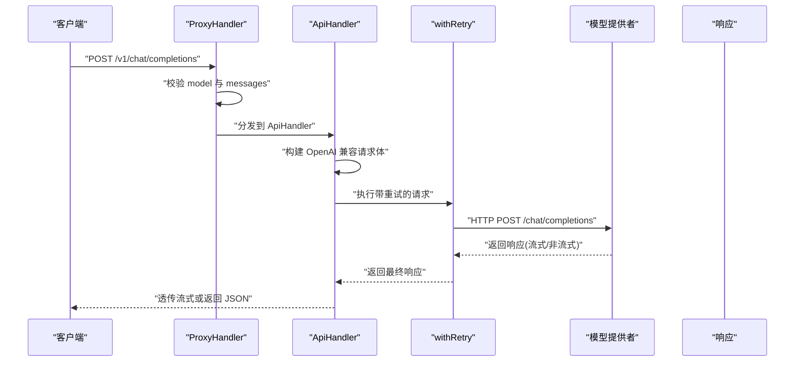
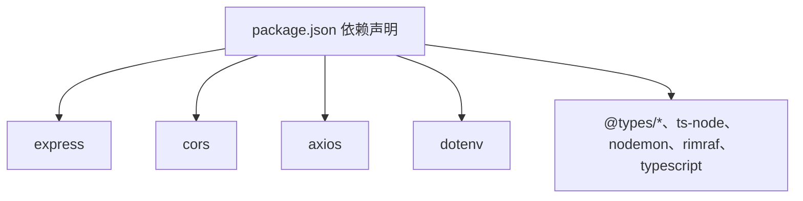

# 项目概述

<cite>
**本文档引用的文件**
- [package.json](file://package.json)
- [tsconfig.json](file://tsconfig.json)
- [src/server.ts](file://src/server.ts)
- [src/config/config.ts](file://src/config/config.ts)
- [src/config/models/index.ts](file://src/config/models/index.ts)
- [src/config/models/base.ts](file://src/config/models/base.ts)
- [src/config/models/zhipu.ts](file://src/config/models/zhipu.ts)
- [src/config/models/gemini.ts](file://src/config/models/gemini.ts)
- [src/config/models/kimi.ts](file://src/config/models/kimi.ts)
- [src/config/models/qwen.ts](file://src/config/models/qwen.ts)
- [src/config/models/google.ts](file://src/config/models/google.ts)
- [src/config/models/zhipu.ts](file://src/config/models/zhipu.ts)
- [src/config/models/gemini.ts](file://src/config/models/gemini.ts)
- [src/config/models/kimi.ts](file://src/config/models/kimi.ts)
- [src/config/models/qwen.ts](file://src/config/models/qwen.ts)
- [src/handlers/base.ts](file://src/handlers/base.ts)
- [src/handlers/api.ts](file://src/handlers/api.ts)
- [src/handlers/proxy.ts](file://src/handlers/proxy.ts)
- [src/middlewares/common.ts](file://src/middlewares/common.ts)
- [src/utils/network.ts](file://src/utils/network.ts)
- [src/utils/retry.ts](file://src/utils/retry.ts)
- [src/types/api.ts](file://src/types/api.ts)
- [src/types/config.ts](file://src/types/config.ts)
</cite>

## 目录
1. [引言](#引言)
2. [项目结构](#项目结构)
3. [核心组件](#核心组件)
4. [架构总览](#架构总览)
5. [详细组件分析](#详细组件分析)
6. [依赖关系分析](#依赖关系分析)
7. [性能考虑](#性能考虑)
8. [故障排除指南](#故障排除指南)
9. [结论](#结论)
10. [附录](#附录)

## 引言
xcode-ai-proxy 是一个专为 Xcode 开发者设计的 AI API 代理服务，旨在简化多厂商大模型接入与统一调用体验。其核心价值在于：
- 统一入口：以 OpenAI 兼容接口对外暴露，屏蔽不同模型提供商的差异
- 类型安全：基于 TypeScript 提供完整的请求/响应类型定义
- 多提供商支持：内置对智谱、Kimi、Gemini、通义千问等主流模型的支持
- 流式响应：完整支持 SSE 流式输出，满足实时对话场景
- 智能重试：内置指数退避重试机制，提升网络波动下的稳定性
- 易于集成：提供一键启动的服务与清晰的配置项，便于在 Xcode 中直接使用

该服务面向两类用户：
- 初学者：通过统一的 OpenAI 兼容接口快速接入多个模型，无需关心底层差异
- 有经验的开发者：利用可扩展的配置与中间件体系，灵活定制行为与增强能力

## 项目结构
项目采用按职责分层的组织方式，核心目录与文件如下：
- src/server.ts：应用入口，负责初始化 Express 应用、注册中间件、路由与错误处理，并启动服务
- src/config：配置管理与模型提供者系统
  - config.ts：集中读取环境变量、校验必要密钥、构建应用配置与模型配置
  - models：各模型提供者的实现，统一通过 BaseModelProvider 抽象
- src/handlers：请求处理器
  - base.ts：抽象基类，提供通用的请求校验、错误发送与日志记录
  - api.ts：具体 API 代理逻辑，负责向各提供商转发请求、处理流式与非流式响应
  - proxy.ts：路由层的代理处理器，负责模型选择与路由分发
- src/middlewares：通用中间件
  - common.ts：日志中间件与全局错误处理
- src/utils：工具函数
  - network.ts：本地 IP 与访问地址解析
  - retry.ts：带指数退避的重试封装
- src/types：类型定义
  - api.ts：OpenAI 兼容的聊天与模型列表类型
  - config.ts：应用配置与模型配置类型
- package.json/tsconfig.json：项目依赖与编译配置

图表来源
- [src/server.ts:1-88](file://src/server.ts#L1-L88)
- [src/config/config.ts:1-121](file://src/config/config.ts#L1-L121)
- [src/config/models/index.ts:1-5](file://src/config/models/index.ts#L1-L5)
- [src/handlers/base.ts:1-40](file://src/handlers/base.ts#L1-L40)
- [src/handlers/api.ts:1-196](file://src/handlers/api.ts#L1-L196)
- [src/handlers/proxy.ts:1-66](file://src/handlers/proxy.ts#L1-L66)
- [src/middlewares/common.ts:1-25](file://src/middlewares/common.ts#L1-L25)
- [src/utils/network.ts:1-51](file://src/utils/network.ts#L1-L51)
- [src/utils/retry.ts:1-34](file://src/utils/retry.ts#L1-L34)
- [src/types/api.ts:1-58](file://src/types/api.ts#L1-L58)
- [src/types/config.ts:1-48](file://src/types/config.ts#L1-L48)

章节来源
- [src/server.ts:1-88](file://src/server.ts#L1-L88)
- [package.json:1-30](file://package.json#L1-L30)
- [tsconfig.json](file://tsconfig.json)

## 核心组件
- 服务器与路由
  - XcodeAiProxyServer：初始化 Express 应用，注册 CORS、JSON 解析、日志中间件；挂载健康检查、模型列表与聊天补全路由；统一错误处理；启动监听并打印启动信息
  - 路由覆盖：/health、/v1/models、/v1/chat/completions、/api/v1/chat/completions、/v1/messages
- 配置管理
  - ConfigManager：单例模式，读取环境变量，校验至少存在一个 API 密钥；构建应用配置（端口、主机、最大重试、重试延迟、请求超时、自定义系统提示）；聚合各模型提供者的模型配置
- 模型提供者系统
  - BaseModelProvider 抽象：定义提供者名称与可用性判断
  - 具体提供者：ZhipuProvider、KimiProvider、GeminiProvider、QwenProvider，每个提供者返回一组模型映射，包含类型、提供商名、API 地址、鉴权密钥与模型别名
- 处理器
  - BaseHandler：统一请求校验（model、messages）、错误发送与日志记录
  - ProxyHandler：根据请求中的 model 选择对应模型配置，分发到 ApiHandler；提供模型列表与健康检查
  - ApiHandler：构建 OpenAI 兼容请求体，注入中文交流指令与自定义系统提示；根据是否流式设置响应类型；透传流式响应或返回 JSON 响应；使用 withRetry 执行带指数退避的重试
- 中间件
  - loggingMiddleware：记录请求方法与路径
  - errorHandler：统一捕获异常并返回标准错误结构
- 工具
  - network：解析本地 IP、主 IP 与服务访问 URL，便于在多网卡环境下定位服务
  - retry：withRetry 实现指数退避重试，支持最大重试次数与基础延迟
- 类型
  - api.ts：ChatCompletionRequest/Response、模型列表与错误响应的标准类型
  - config.ts：应用配置、模型配置与环境变量类型

章节来源
- [src/server.ts:8-84](file://src/server.ts#L8-L84)
- [src/config/config.ts:7-121](file://src/config/config.ts#L7-L121)
- [src/config/models/base.ts](file://src/config/models/base.ts)
- [src/config/models/zhipu.ts:1-34](file://src/config/models/zhipu.ts#L1-L34)
- [src/config/models/gemini.ts:1-34](file://src/config/models/gemini.ts#L1-L34)
- [src/config/models/kimi.ts](file://src/config/models/kimi.ts)
- [src/config/models/qwen.ts](file://src/config/models/qwen.ts)
- [src/config/models/google.ts](file://src/config/models/google.ts)
- [src/handlers/base.ts:1-40](file://src/handlers/base.ts#L1-L40)
- [src/handlers/proxy.ts:1-66](file://src/handlers/proxy.ts#L1-L66)
- [src/handlers/api.ts:1-196](file://src/handlers/api.ts#L1-L196)
- [src/middlewares/common.ts:1-25](file://src/middlewares/common.ts#L1-L25)
- [src/utils/network.ts:1-51](file://src/utils/network.ts#L1-L51)
- [src/utils/retry.ts:1-34](file://src/utils/retry.ts#L1-L34)
- [src/types/api.ts:1-58](file://src/types/api.ts#L1-L58)
- [src/types/config.ts:1-48](file://src/types/config.ts#L1-L48)

## 架构总览
下图展示了从客户端请求到各模型提供商的完整链路，以及服务内部的模块交互。

图表来源
- [src/server.ts:23-44](file://src/server.ts#L23-L44)
- [src/handlers/proxy.ts:9-37](file://src/handlers/proxy.ts#L9-L37)
- [src/handlers/api.ts:30-195](file://src/handlers/api.ts#L30-L195)
- [src/utils/retry.ts:1-34](file://src/utils/retry.ts#L1-L34)
- [src/config/config.ts:67-97](file://src/config/config.ts#L67-L97)
- [src/types/api.ts:1-58](file://src/types/api.ts#L1-L58)
- [src/types/config.ts:1-48](file://src/types/config.ts#L1-L48)

## 详细组件分析

### 服务器与路由（XcodeAiProxyServer）
- 初始化流程
  - 创建 Express 应用实例
  - 获取 ConfigManager 单例与 ProxyHandler 实例
  - 注册 CORS、JSON 解析与日志中间件
  - 挂载健康检查、模型列表与聊天补全路由
  - 注册全局错误处理中间件
  - 读取应用配置并启动监听，同时打印启动信息（含支持模型、重试配置、Xcode 配置建议）
- 启动信息包含
  - 服务访问地址（本机、局域网、其他网卡）
  - 支持的模型清单
  - 重试与超时配置
  - Xcode 环境变量配置建议（如 ANTHROPIC_BASE_URL、AUTH_TOKEN）

图表来源
- [src/server.ts:13-84](file://src/server.ts#L13-L84)

章节来源
- [src/server.ts:8-84](file://src/server.ts#L8-L84)

### 配置管理（ConfigManager）
- 环境变量校验
  - 必须至少配置一个提供商的 API 密钥（ZHIPU/KIMI/GEMINI/QWEN），否则终止进程
- 应用配置
  - 端口、主机、最大重试次数、重试延迟（毫秒）、请求超时（毫秒）、自定义系统提示
- 模型配置聚合
  - 为每个可用的提供商创建对应的 Provider 实例，并合并其返回的模型映射
  - 模型映射包含类型、提供商名、API 地址、鉴权密钥与模型别名
- 运行时日志
  - 输出已加载的模型清单，便于确认配置生效

图表来源
- [src/config/config.ts:27-121](file://src/config/config.ts#L27-L121)

章节来源
- [src/config/config.ts:7-121](file://src/config/config.ts#L7-L121)

### 模型提供者系统（BaseModelProvider 与具体实现）
- 抽象基类
  - BaseModelProvider：定义提供者名称与可用性判断接口
- 具体实现
  - ZhipuProvider：返回 glm-4.5 模型映射，指定 API 地址与模型别名
  - KimiProvider：返回对应模型映射，支持可选 API 地址
  - GeminiProvider：返回 gemini-2.5-pro 模型映射，兼容 OpenAI 兼容端点
  - QwenProvider：返回对应模型映射，支持可选 API 地址
- Provider 聚合
  - ConfigManager 将各 Provider 的模型映射合并，形成统一的模型配置表

图表来源
- [src/config/models/base.ts](file://src/config/models/base.ts)
- [src/config/models/zhipu.ts:1-34](file://src/config/models/zhipu.ts#L1-L34)
- [src/config/models/gemini.ts:1-34](file://src/config/models/gemini.ts#L1-L34)
- [src/config/models/kimi.ts](file://src/config/models/kimi.ts)
- [src/config/models/qwen.ts](file://src/config/models/qwen.ts)

章节来源
- [src/config/models/index.ts:1-5](file://src/config/models/index.ts#L1-L5)
- [src/config/models/zhipu.ts:1-34](file://src/config/models/zhipu.ts#L1-L34)
- [src/config/models/gemini.ts:1-34](file://src/config/models/gemini.ts#L1-L34)
- [src/config/models/kimi.ts](file://src/config/models/kimi.ts)
- [src/config/models/qwen.ts](file://src/config/models/qwen.ts)
- [src/config/models/google.ts](file://src/config/models/google.ts)

### 处理器（BaseHandler、ProxyHandler、ApiHandler）
- BaseHandler
  - 校验请求体必须包含 model 与合法 messages 数组
  - 统一错误发送格式
  - 记录模型请求与流式标志
- ProxyHandler
  - 根据请求中的 model 查找模型配置
  - 当前仅支持 type 为 api 的模型，统一交由 ApiHandler 处理
  - 提供 /v1/models 与 /health 接口
- ApiHandler
  - 构建 OpenAI 兼容请求体，注入中文交流指令与自定义系统提示
  - 对 Qwen 移除空的 tools 字段
  - 使用 Bearer 认证，针对 Kimi 配置 HTTPS Agent
  - 根据 stream 决定响应类型：透传流式或返回 JSON
  - 使用 withRetry 执行指数退避重试
  - 对 4xx/5xx 响应进行特殊处理，支持从流中读取错误内容

图表来源
- [src/handlers/proxy.ts:9-37](file://src/handlers/proxy.ts#L9-L37)
- [src/handlers/api.ts:30-195](file://src/handlers/api.ts#L30-L195)
- [src/utils/retry.ts:1-34](file://src/utils/retry.ts#L1-L34)

章节来源
- [src/handlers/base.ts:1-40](file://src/handlers/base.ts#L1-L40)
- [src/handlers/proxy.ts:1-66](file://src/handlers/proxy.ts#L1-L66)
- [src/handlers/api.ts:1-196](file://src/handlers/api.ts#L1-L196)

### 中间件与工具
- 日志中间件
  - 记录每次请求的方法与路径，便于调试
- 全局错误处理
  - 捕获未处理异常，返回标准错误结构
- 网络工具
  - 解析本地 IP 地址与主 IP，生成服务访问 URL，支持多网卡场景
- 重试工具
  - withRetry 实现指数退避重试，支持最大重试次数与基础延迟

章节来源
- [src/middlewares/common.ts:1-25](file://src/middlewares/common.ts#L1-L25)
- [src/utils/network.ts:1-51](file://src/utils/network.ts#L1-L51)
- [src/utils/retry.ts:1-34](file://src/utils/retry.ts#L1-L34)

### 类型系统
- 请求与响应
  - ChatCompletionRequest：包含 model、messages、可选参数（max_tokens、temperature、stream、top_p 等）
  - ChatCompletionResponse：包含 id、object、created、model、choices、usage
- 模型列表
  - ModelInfo：id、object、created、owned_by、name
  - ModelsResponse：object、data
- 错误响应
  - ErrorResponse：error.message、error.type、可选 code
- 配置类型
  - ApiModelConfig：type、apiUrl、apiKey、provider、model、maxTokens、temperature
  - AppConfig：port、host、maxRetries、retryDelay、requestTimeout、customSystemPrompt
  - EnvConfig：各提供商 API 密钥与可选 URL、自定义系统提示、运行参数

章节来源
- [src/types/api.ts:1-58](file://src/types/api.ts#L1-L58)
- [src/types/config.ts:1-48](file://src/types/config.ts#L1-L48)

## 依赖关系分析
- 运行时依赖
  - express：Web 框架
  - cors：跨域支持
  - axios：HTTP 客户端，用于向各提供商发起请求
  - dotenv：加载 .env 文件中的环境变量
- 开发时依赖
  - @types/*：Express、Node、CORS 类型定义
  - ts-node/nodemon：开发与热重载
  - rimraf：清理构建产物
  - typescript：编译器与类型检查

图表来源
- [package.json:14-28](file://package.json#L14-L28)

章节来源
- [package.json:1-30](file://package.json#L1-L30)

## 性能考虑
- 流式响应
  - 当客户端启用 stream 时，服务会透传提供商的流式响应，减少内存占用并提升实时性
- 指数退避重试
  - withRetry 提供可配置的最大重试次数与基础延迟，避免瞬时网络抖动导致的失败
- 请求超时控制
  - 通过 AppConfig.requestTimeout 控制请求超时时间，防止长时间阻塞
- HTTPS Agent（Kimi）
  - 针对 Kimi 提供 HTTPS Agent 配置，优化连接复用与安全性
- 日志与可观测性
  - 统一日志中间件与启动信息输出，便于问题定位与性能观察

## 故障排除指南
- 启动阶段
  - 至少配置一个提供商的 API 密钥，否则服务会直接退出
  - 检查端口与主机绑定是否正确，可通过启动信息中的访问地址定位
- 请求阶段
  - 若返回 4xx/5xx，服务会尝试从流中读取错误内容并输出详细信息
  - 确认 model 是否在支持列表内，否则会返回“不支持的模型”错误
- 网络与重试
  - 如遇网络不稳定，可适当增加 MAX_RETRIES 与 RETRY_DELAY
  - 检查 REQUEST_TIMEOUT 是否足够长以容纳慢响应
- Xcode 集成
  - 参考启动信息中的 Xcode 配置建议，设置正确的 BASE_URL 与 AUTH_TOKEN

章节来源
- [src/config/config.ts:27-49](file://src/config/config.ts#L27-L49)
- [src/server.ts:54-83](file://src/server.ts#L54-L83)
- [src/handlers/api.ts:124-164](file://src/handlers/api.ts#L124-L164)
- [src/utils/retry.ts:1-34](file://src/utils/retry.ts#L1-L34)

## 结论
xcode-ai-proxy 通过统一的 OpenAI 兼容接口与完善的类型系统，为 Xcode 开发者提供了稳定、易用且可扩展的 AI API 代理服务。其模块化设计使得新增模型提供商变得简单，而内置的流式响应与智能重试机制则显著提升了用户体验与鲁棒性。对于初学者，它降低了多模型接入的门槛；对于有经验的开发者，它提供了足够的灵活性与可定制空间。

## 附录
- 常见用例
  - 在 Xcode 中配置 BASE_URL 指向本机或局域网地址，AUTH_TOKEN 任意字符串即可
  - 发送 /v1/chat/completions 请求，携带 model 与 messages，支持开启 stream 实时接收
  - 通过 /v1/models 获取当前支持的模型列表，便于前端选择
  - 通过 /health 检查服务健康状态
- 配置建议
  - 至少配置一个提供商的 API 密钥与可选 API URL
  - 根据网络状况调整 MAX_RETRIES、RETRY_DELAY 与 REQUEST_TIMEOUT
  - 如需中文优先回复，可保持默认中文交流指令；如需更严格的上下文约束，可配置 CUSTOM_SYSTEM_PROMPT